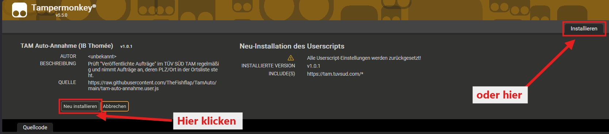

# TAM Auto-Annahme (IB Thomée GmbH)

Tampermonkey-Userscript für das **TÜV SÜD Auftragsmanagement (TAM)**. Es prüft den Tab
**„[Meine Aufträge] Veröffentlichte Aufträge“** und nimmt passende Aufträge automatisch an –
anhand der Ortsliste der IB Thomée GmbH.

<p align="center">
  <a href="https://raw.githubusercontent.com/TheFishflap/TamAuto/main/tam-auto-annahme.user.js">
    
  </a>
</p>

## ✨ Funktionen auf einen Blick

### 🎯 Automatische Annahme
| | |
|---|---|
| **PLZ-Abgleich** | Treffer, wenn die PLZ mit einem Eintrag der Ortsliste beginnt (`43` = alle 43xxx, `47877` = genau diese) |
| **Komplette Annahme** | Auftragskarte öffnen → 0-km-Aufträge dazu → Warenkorb „alle auswählen“ → Annehmen → Bedingungen bestätigen |
| **Bulk-Erfassung** | Alle im Warenkorb mit angenommenen Aufträge werden verbucht und nicht erneut versucht |
| **Schnell zurück** | Nach „Bestätigen“ sofort zurück in „Veröffentlichte Aufträge“; TAMs Antwort wird im Hintergrund geprüft (bei „bereits vergeben“ wird die Buchung korrigiert) |
| **Wächter-Modus** | Schließt störende TAM-Meldungen **in Millisekunden** – „bereits vergeben“, „nicht verfügbar“, „falscher Status“, Warenkorb-Hinweise, technische Fehlerfenster – und wertet sie trotzdem richtig aus |
| **Neue-Zeilen-Wächter** | Erkennt neue Aufträge in „Veröffentlichte Aufträge“ sofort bei der Tabellenänderung – auch wenn TAM sie ohne Refresh einblendet |
| **Silent Reload** | Optional (Erweiterte Einstellungen, Checkbox wie beim Auto-Refresh, Standard aus, nur in der Arbeitszeit): fragt TAM alle x s im Hintergrund nach neuen Aufträgen – ohne Tabelle neu zu zeichnen; nur bei einem neuen Auftrag wird aktualisiert |
| **Arbeitszeit** | Standard **08:00–18:00** (einstellbar, an/aus): außerhalb pausieren Auto-Refresh und Silent Reload, danach laufen sie automatisch mit den zuletzt eingestellten Werten weiter |
| **Push-Signal** | Die App **TAM-Signal** auf 1–2 Master-Handys leitet die Push-Benachrichtigungen der TAM-App als Startsignal über ntfy.sh weiter – das Script fragt TAM **innerhalb von ca. 1 s** ab (Standard an, gemeinsamer Kanal voreingestellt; verbindet sich nach Schlaf/Netzwechsel selbst neu; eigener Reiter „Push-Signal“) |
| **Priorität** | Mehrere passende Aufträge gleichzeitig → Reihenfolge nach **Stufe 1, 2, 3** frei wählbar (Anzahl am Ort, Summe am Ort, Einzelpreis) mit automatischer Zuordnung; Standard: Anzahl → Summe → Preis |
| **Fern-Lizenzierung** | „Lizenz anfragen“ direkt im Script → Freischaltung in der Lizenzverwaltung von IB Thomée → das Script **aktiviert sich selbst**; Verlängerung per Klick (Reiter Info); signierte **Sperrliste** zum Entziehen (7 Tage offline erlaubt) |
| **Verzögerung** | Standard an: 0,12 s + Randomizer (bis 80 ms) vor jedem Klickschritt, einstellbar 0–0,5 s |
| **Termin offen** | Terminvereinbarung nach der Annahme weggeklickt und SLA-Ende (laut „Angenommene Aufträge“) in ≤ 2 h → **rote 1** im Auftragsbuch |
| **Ihr Zeichen** | Im Auftragsbuch: Haken „Ihr Zeichen setzen“, Text (max. 20 Zeichen wie in TAM), Aufträge anklicken, „In TAM übernehmen“ – still gespeichert, ohne Fenster; belegte Felder (grau) werden nicht überschrieben |

### 🔄 Aktualisierung – gezielt statt dauerhaft
| | |
|---|---|
| **Tabwechsel-Refresh** | Beim Zurückwechseln in „Veröffentlichte Aufträge“ wird genau einmal aktualisiert |
| **Nachfragen nach Refresh** | Nach einem manuellen Refresh fragt das Script nach 1 s und 2 s je einmal still bei TAM nach – lädt nur bei neuen Aufträgen neu |
| **Auto-Refresh** | Optional (Standard aus, 60 s), am TAM-Takt ausgerichtet – kein doppeltes Laden |
| **TAM-Takt mitlesen** | Ohne Auto-Refresh wird die nächste TAM-Aktualisierung aus TAM selbst gelesen („laut TAM“); mit Auto-Refresh zeigt die Statuszeile nur dessen Countdown |

### 📋 Listen
| | |
|---|---|
| **Ortsliste** | Excel in SharePoint (Blatt „annehmen“), ohne Anmeldung, alle 30 min neu geladen |
| **Sperrliste** | Excel-Blatt „nicht annehmen“ – diese PLZ werden nie angenommen (in der TAM-Tabelle **braun**); Blatt „nicht annehmen Adresse“ sperrt einzelne Adressen (PLZ + Straße) |
| **Farbige TAM-Einträge** | Optional, Standard an: grün = wird angenommen, grau = nicht auf der Annahmeliste, braun = gesperrt, orange = zurückgegeben; angenommene und laut stiller Abfrage vergebene Aufträge ausgeblendet (Tabelle bleibt aktuell ohne Neuladen) – nur lokale Anzeige |
| **Rückgaben** | Heute angenommene und wieder zurückgegebene Aufträge werden auf **allen Geräten** bis Mitternacht nicht angenommen (in der TAM-Tabelle **orange**) |
| **Tages-Annahmeliste** | Einzelne 5-stellige PLZ heute zusätzlich annehmen |

### 📊 Überblick & Komfort
| | |
|---|---|
| **Auftragsbuch** | Alle angenommenen Aufträge mit Summe in Euro, PLZ-Übersicht und **Trefferquote** |
| **Tab-Anzeige** | Zeigt, ob das Script gerade bereit zum Annehmen ist |
| **Benachrichtigungen** | Gong mit Lautstärke-Regler und Desktop-Popups, beides mit Test-Button |
| **Bedienfeld** | Verschiebbar, in der Größe änderbar, bleibt immer greifbar, Reiter für Bedienung / Einstellungen / Auftragsbuch / Info |
| **Updates** | Automatisch über GitHub; läuft auch ohne GitHub weiter |
| **Lizenz** | Aktivierung pro Installation, Laufzeit 1 / 3 / 6 Monate oder bis Jahresende |

---

## Installation

### Schritt 1 – Tampermonkey installieren (einmalig)

Tampermonkey ist eine Browser-Erweiterung, die das Script im TAM ausführt. Link für den eigenen Browser öffnen
und dort auf **„Hinzufügen“** bzw. **„Zu Firefox hinzufügen“** klicken:

| Browser | Download |
|---|---|
| **Firefox** | [Tampermonkey für Firefox](https://addons.mozilla.org/de/firefox/addon/tampermonkey/) |
| **Chrome** | [Tampermonkey für Chrome](https://chromewebstore.google.com/detail/tampermonkey/dhdgffkkebhmkfjojejmpbldmpobfkfo) |
| **Edge** | [Tampermonkey für Edge](https://microsoftedge.microsoft.com/addons/detail/tampermonkey/iikmkjjbdkfcflbeekkhoceijjpeceki) |

> **Nur Chrome / Edge:** Nach der Installation in der Erweiterungsverwaltung (`chrome://extensions` bzw.
> `edge://extensions`) bei Tampermonkey auf **Details** gehen und **„Nutzerskripts zulassen“** einschalten
> (bei älteren Versionen oben rechts den **Entwicklermodus** aktivieren). Sonst läuft das Script nicht.

### Schritt 2 – Script installieren

1. Auf den grünen Button **[⬇ Script installieren](https://raw.githubusercontent.com/TheFishflap/TamAuto/main/tam-auto-annahme.user.js)**
   klicken (auch ganz oben auf dieser Seite).
2. Tampermonkey öffnet eine Seite mit den Script-Infos. Dort auf **„Installieren“** klicken:

   

   *Ist das Script schon installiert, heißt der Button „Neu installieren“ bzw. „Aktualisieren“.*
3. TAM neu laden (Taste **F5**). Unten rechts erscheint das Bedienfeld **„TAM Auto-Annahme“**.

Ein GitHub-Konto ist **nicht** nötig. Updates kommen danach automatisch (siehe unten).

### Schritt 3 – Lizenz aktivieren

Ohne Lizenz zeigt das Bedienfeld nur **„Lizenz erforderlich“** und eine **Installations-ID**
(z. B. `ABCD-EFGH-JKLM-NPQR`) – das Script nimmt dann nichts an.

1. Installations-ID mit **„Kopieren“** kopieren und an die IB Thomée GmbH schicken.
2. Den erhaltenen Lizenzschlüssel (beginnt mit `TAM1.`) einfügen und **„Aktivieren“** klicken.

Die Lizenz gilt nur für diese eine Installation und ist befristet: **1 Monat, 3 Monate, 6 Monate oder bis
zum 31.12. des laufenden Jahres** (Ablaufdatum und Dauer stehen im Reiter **Info**). Vor Ablauf erscheint ein
roter Hinweis (30 Tage vorher, bei kurzen Lizenzen im letzten Viertel der Laufzeit); danach ist eine neue Lizenz nötig.
Bei **Updates und Neuinstallation des Scripts** bleibt die Aktivierung erhalten (ID und Schlüssel sind
zusätzlich im Browser gesichert, auch das Löschen von Cookies bzw. Website-Daten schadet nicht).
Die Lizenz ist an das **Gerät** gebunden: Wird ein Tampermonkey-Backup auf einem anderen Gerät eingespielt oder ein
anderer Browser genutzt, ist dort eine eigene Aktivierung nötig („Lizenz anfragen“).

> Empfehlung: In Tampermonkey unter *Einstellungen → Userscript-Updates* „Updates prüfen“
> auf **täglich** stellen. Zusätzlich prüft das Script selbst alle 6 Stunden auf GitHub.

## Automatische Updates

- Tampermonkey aktualisiert über `@updateURL` / `@downloadURL` (Raw-Datei im Branch `main`).
- Das Bedienfeld zeigt **„⬆ Update x.y.z verfügbar – installieren“**, sobald auf GitHub eine
  neuere `@version` liegt. Button **„Softwareupdate“** (Reiter **Info**) prüft sofort.
- Neue Version veröffentlichen: `@version` im Script erhöhen, Changelog ergänzen, nach `main` pushen.

## Bedienfeld

| Element | Funktion |
|---|---|
| **Tab-Anzeige** | Aktiver Reiter und Bereitschaft: **Veröffentlichte Aufträge – ✔ bereit zum Annehmen** (grün), **Angenommene Aufträge – ⏸ Annahme pausiert** (orange), sonst pausiert |
| **Start / Stop** | Automatische Prüfung und **verbindliche** Annahme ein/aus |
| **Auto-Refresh** | Optional – klickt regelmäßig den Refresh-Pfeil der Tabelle, am TAM-Takt ausgerichtet (unabhängig von Start/Stop). **Standard: aus** |
| **alle … s** | Intervall für Refresh und Abgleich – Standard **60 s**, Minimum **10 s**. Niedriger = höhere Auslastung, mit Bedacht wählen. **Über 60 s** schaltet sich Auto-Refresh ab; der Abgleich läuft dann synchron mit der TAM-eigenen Aktualisierung (bleibt immer an). Erklärung auch über das **?** |
| **Neu laden** | Bei der Ortsliste: lädt **beide** Listen neu – Ortsliste (Blatt „annehmen“) und Sperrlisten (Blätter „nicht annehmen“, „nicht annehmen Adresse“) aus dem Excel in SharePoint, ohne Anmeldung; Ergebnis im Log; automatisch alle 30 min |

### Sperren (Reiter „Bedienung“)

Gesperrt wird über das Excel-Blatt **„nicht annehmen“** (Sperrliste aus Excel, Anzeige im Reiter „Bedienung“,
Anzahl im Kopf des Bedienfelds „Sperrliste: x“) und über **„Heute zurückgegeben“** (siehe unten).
Gesperrte Treffer stehen im Protokoll („Treffer, aber gesperrt: … → nicht angenommen“) und sind in der TAM-Tabelle
markiert: **braun** = Excel-Sperrliste, **orange** = heute zurückgegeben (Grund im Tooltip der Zeile).

**Autohaus-Regeln – Blatt „nicht annehmen Adresse“** (Spalten **PLZ | Straße**): sperrt nur diese eine Adresse, nicht die
ganze PLZ – z. B. `50825 | Maarweg 241` (nur Hausnummer 241) oder `50825 | Venloer Str.` (ganze Straße). Schreibweisen wie
„Str.“/„Straße“ und Hausnummern-Bereiche („241-251“) werden erkannt. Eigenes Blatt, damit ältere Versionen nicht die ganze
PLZ sperren.

**Heute zurückgegeben:** Jedes Gerät meldet seine Annahmen (nur Auftragsnummern) an die anderen Geräte. Taucht ein heute
angenommener Auftrag wieder in „Veröffentlichte Aufträge“ auf (mind. 60 s verschwunden), gilt er als zurückgegeben und wird
auf allen Geräten bis Mitternacht nicht angenommen. Anzeige im Reiter „Bedienung“; Klick auf einen Eintrag gibt ihn auf
diesem Gerät wieder frei.

**Tages-Annahmeliste** (Reiter „Bedienung“): PLZ, die **heute zusätzlich** angenommen werden – **nur vollständige
5-stellige PLZ** (z. B. `47877`), damit nicht versehentlich ganze Gebiete angenommen werden. Leert sich um Mitternacht;
Entfernen per Klick auf den grünen Eintrag oder „Alle entfernen“. Nach dem Hinzufügen wird sofort abgeglichen.
Steht eine PLZ zusätzlich auf einer Sperrliste, gilt die Sperre.

**Sperrliste aus Excel:** Zusätzlich gilt das Blatt **„nicht annehmen“** derselben Excel-Datei
(gleiche Spalten und PLZ-Logik wie „annehmen“). Einträge dort gelten, **solange sie im Excel stehen**
(nicht nur heute). Das Excel wird alle 30 min neu geladen, sofort per **„Neu laden“**. Die Einträge
werden im Reiter angezeigt (braun), ändern nur im Excel. Fehlt das Blatt, ist die Sperrliste leer –
das Blatt „annehmen“ wird nie als Sperrliste verwendet.

**Verzögerung** (ebenfalls in „Erweiterte Einstellungen“): Checkbox + Slider **0,001–0,500 s** in 1-ms-Schritten
(Standard **an**, **0,12 s**).
Vor jedem Klickschritt der Annahme (Doppelklick, 0-km-Aufträge, alle auswählen, Annehmen, Haken, Bestätigen)
wird die eingestellte Zeit gewartet. Mit **Randomizer** kommt bei jedem Schritt zufällig **0 bis x ms** dazu
(Standard **80 ms**, einstellbar 0–500 ms), bei jedem Schritt neu gewürfelt.

### Reiter „Erweiterte Einstellungen“

**Tipps ausblenden**: blendet alle **?**-Erklärungen im Bedienfeld aus (aufgeräumte Ansicht) – auch das **?**
an dieser Checkbox. Wieder einblenden: Haken entfernen.

### TAM-Fehlerfenster und Android

TAM ist für den Desktop gebaut. Vor allem auf **Android** (z. B. Firefox) zeigt TAM gelegentlich technische
Fehlerfenster wie **„Fehler! (TypeError): can't access property …, … is undefined“**. Das Script schließt solche
Fenster automatisch mit „Abbrechen“ und schreibt ins Log, **was es selbst zuletzt getan hat und wie lange das her
ist** (z. B. „letzte Script-Aktion: Refresh-Pfeil vor 0,3 s“). So lässt sich erkennen, ob der Fehler vom Script oder
von TAM allein kommt. Fachliche Meldungen (z. B. „Auftrag bereits vergeben!“) sind davon nicht betroffen.
Auf Android zeigt der Reiter **Info** einen entsprechenden Hinweis.

**Klicks auf Android:** Das Script simuliert dort echte **Fingertipps** (`touchstart`/`touchend`, danach die
Maus-Ereignisse – genau wie der Browser bei einem Tipp).

**Bildschirm anlassen (Wake Lock)** – Reiter „Erweiterte Einstellungen“, auf Android standardmäßig **an**:
Geht der Bildschirm aus oder wird der Browser in den Hintergrund gelegt, **friert Android die Seite ein** – das
Script kann dann nicht mehr prüfen und annehmen (das kann kein Webseiten-Script umgehen). Die Option hält den
Bildschirm an, solange TAM im Vordergrund offen ist, und fordert das nach dem Zurückkehren automatisch neu an.
Empfehlungen für den Dauerbetrieb am Handy:
- Gerät **ans Ladegerät**, Helligkeit herunterdrehen, TAM im Vordergrund lassen.
- Falls der Browser Wake Lock nicht unterstützt: *Einstellungen → Display → Bildschirm-Timeout* hochsetzen oder in den
  **Entwickleroptionen „Aktiv lassen“** (Bildschirm bleibt beim Laden an) einschalten.
- *Einstellungen → Apps → Firefox → Akku* auf **„Nicht eingeschränkt“** stellen.
- Zuverlässigster Betrieb bleibt ein **PC/Laptop** mit geöffnetem Browserfenster.

**Benachrichtigungston** (Standard **an**): Gong bei angenommenem oder fehlgeschlagenem Auftrag ein/aus.
**Schieberegler** für die Lautstärke (0–100 %, Standard 60 %), Doppelklick = 60 %;
nach dem Verstellen wird der Ton einmal vorgespielt. **▶ Test** spielt ihn ab.
**Popups** (Standard **an**): Desktop-Benachrichtigung bei Annahme ein/aus; **▶ Test** zeigt eine
Test-Benachrichtigung. Erscheint nichts → [Popups einschalten](#popups-einschalten) (auch über das **?** daneben).

#### Popups einschalten

Die Popups kommen als Windows-Benachrichtigung vom Browser. Erscheint beim **▶ Test** nichts:

1. **Windows-Benachrichtigungen erlauben:** Windows-Taste → *Einstellungen* → *System* → *Benachrichtigungen*.
   - „Benachrichtigungen“ **ein**.
   - In der Liste darunter den eigenen Browser (**Google Chrome**, **Microsoft Edge** oder **Firefox**) **ein**.
2. **„Nicht stören“ / Fokus-Assistent ausschalten:** ebenfalls unter *System* → *Benachrichtigungen*
   bzw. *Fokus* – solange „Nicht stören“ aktiv ist, zeigt Windows keine Popups (sie landen nur in der Mitteilungszentrale).
3. **Browser-Einstellung (nur falls nötig):**
   - Chrome: `chrome://settings/content/notifications` – „Websites dürfen Benachrichtigungen senden“ nicht komplett blockieren.
   - Edge: `edge://settings/content/notifications` – nicht komplett blockieren.
   - Firefox: *Einstellungen* → *Datenschutz & Sicherheit* → *Berechtigungen* → *Benachrichtigungen* – nicht „Neue Anfragen blockieren“ für alles.
4. Browser **neu starten**, TAM neu laden und **▶ Test** erneut klicken.

Hinweis: Popups und Benachrichtigungston sind unabhängig – der Gong kommt auch ohne Popups.

**Console Log** (ebenfalls in „Erweiterte Einstellungen“, Standard **aus**) mit Button **„📋 Log kopieren“** (ganzes Protokoll in die Zwischenablage): blendet das Protokoll des Scripts
unten im Bedienfeld ein/aus. Das Script schreibt nichts in die Browser-Konsole.

### Reiter „Info“

Version, Button **Softwareupdate** (zeigt „✓ Alles auf dem neuesten Stand“, „⬆ Update … verfügbar“ oder
„✗ GitHub nicht erreichbar – aktueller Stand: v…“), Lizenz (lizenziert für, gültig bis, Installations-ID), Copyright der IB Thomée GmbH,
Kurzfassung der Lizenzbedingungen mit Link auf [LICENSE](LICENSE) und Haftungshinweis.

### Reiter „Auftragsbuch“

Liste aller vom Script angenommenen Aufträge (Datum, AuftragsNr, PLZ, Ort, Euro – Dienstleistung als Tooltip),
Zeitraum wählbar (Heute / letzte 7 Tage / dieser Monat / alle). Unten: **Anzahl Aufträge, Anzahl PLZ,
Summe gesamt in Euro** sowie Aufträge je PLZ. 0-km-Aufträge aus der Umgebung stehen mit drin, haben aber
keinen Preis (steht nicht in der Tabelle). „Liste leeren“ löscht das Auftragsbuch (mit Rückfrage).
Das Auftragsbuch wird nur in diesem Browser gespeichert.

**Trefferquote** (unten im Auftragsbuch, gleicher Zeitraum):
- **passend** = veröffentlichte Aufträge, deren PLZ in der Ortsliste steht (jeder Auftrag einmal gezählt),
- **angenommen**, **bereits vergeben** (beim Öffnen schon an einen anderen Anbieter vergeben), **Fehler**, ggf. **gesperrt**,
- **Angenommen von passenden** und **von tatsächlich verfügbaren** (= versucht und nicht schon vergeben) in Prozent.

## Wenn GitHub nicht erreichbar ist (Störung, Projekt privat oder offline)

Das Script arbeitet **ohne GitHub** weiter: Annahme, Ortslisten (SharePoint), Lizenzprüfung (läuft lokal, ohne
Server) und alle Anleitungen im Bedienfeld (z. B. **?** bei Popups) sind im Script selbst enthalten.
Nur das **automatische Update** und die Installation über den Link fallen aus – „Softwareupdate“ zeigt dann
„GitHub nicht erreichbar – aktueller Stand: v…“.

**Script ohne GitHub installieren oder aktualisieren** (Datei `tam-auto-annahme.user.js` z. B. per OneDrive/E-Mail):
1. Tampermonkey-Symbol in der Browserleiste → **Dashboard** → Reiter **Hilfsmittel** (Utilities).
2. Unter **„Aus Datei importieren“** die Datei `tam-auto-annahme.user.js` auswählen → **Installieren**.
   (Alternativ die Datei in das Tampermonkey-Dashboard ziehen.)
3. TAM neu laden (F5). Eine vorhandene Lizenz bleibt erhalten.

Automatische Updates kommen in diesem Fall nicht; eine neue Version wird auf demselben Weg eingespielt.

## Wächter-Modus (TAM-Meldungen sofort schließen)

TAM blendet während und nach einer Annahme Meldungen ein, die die Oberfläche blockieren oder das Bedienfeld
verdecken. Der Wächter läuft **immer** (auch bei gestopptem Script), prüft alle 100 ms und zusätzlich in dem Moment,
in dem TAM ein Fenster einfügt oder ein vorhandenes wieder einblendet – und schließt diese Meldungen **ohne Verzögerung**
(typisch 10–20 ms, unabhängig von der Klick-Verzögerung der Annahme):

| Meldung | Wirkung im Script |
|---|---|
| „Auftrag bereits vergeben!“ (statt Auftragskarte) | Auftrag zählt als **bereits vergeben**, kein 8-s-Warten auf die Karte |
| „Auftrag nicht (mehr) verfügbar“ nach erfolgreicher Annahme | Annahme gilt als **erfolgt** (Vermerk im Log) |
| „Fehler bei Auftragsannahme – … kann nicht bestätigt werden, da er im falschen Status ist“ | Betrifft es den Hauptauftrag → **nicht angenommen**; betrifft es einen mit angehakten Warenkorb-Auftrag → nur dieser wird nicht verbucht |
| „Es wurden … weitere Aufträge am gleichen Standort automatisch zum Warenkorb hinzugefügt“ | Reine Info → nur ausgeblendet, beeinflusst die Annahme nicht |
| Jede andere Fehlermeldung („Fehler“, „nicht möglich“ …), z. B. nach „Bestätigen“ | Sofort geschlossen; nach „Bestätigen“ gilt die Annahme als **fehlgeschlagen** |
| Technische Fehlerfenster („TypeError … undefined“, v. a. Android) | Mit „Abbrechen“ geschlossen, Log mit letzter Script-Aktion |
| Terminvergabe-Fenster (bis 30 s nach einer Annahme) | Sofort weggeklickt, zurück in „Veröffentlichte Aufträge“ |

Erfasst werden TAM-Fenster, Info-Einblendungen, Tooltips und Dialoge. Reagiert eine Meldung nicht auf den Klick,
wird sie direkt ausgeblendet. Im Log (Console Log) steht jede geschlossene Meldung mit Text und Aufbau.

## Tabwechsel-Refresh und Nachfragen nach einem Refresh (gezielt statt dauerhaft)

Statt die Tabelle dauerhaft im Sekundentakt neu zu laden, aktualisiert das Script **gezielt dann, wenn es darauf ankommt**:

- **Tabwechsel-Refresh:** Beim Wechsel **zurück** in „Veröffentlichte Aufträge“ (z. B. aus „Angenommene Aufträge“
  oder nach einer Annahme) wird **genau einmal** aktualisiert – so ist bei Auftragswellen sofort der aktuelle Stand da.
- **Nachfragen nach einem Refresh von Hand:** Nach einem Klick auf den Refresh-Pfeil **⟳** der TAM-Website (Blätterleiste
  unten an der Tabelle) fragt das Script nach **1 s und 2 s je einmal still** bei TAM nach (wie der Silent Reload). Nur wenn
  dabei ein neuer Auftrag auftaucht, wird die Tabelle neu geladen und abgeglichen.

## Auto-Refresh (ausgerichtet an der TAM-Aktualisierung)

Der Auto-Refresh ist **standardmäßig aus** (Intervall 60 s) – Tabwechsel-Refresh und die Nachfragen decken die
wichtigen Momente ab und erzeugen weniger Last. Wird er eingeschaltet, gilt:

TAM lädt die Tabelle selbst neu („☑ Automatisch alle [x] Minuten aktualisieren“ – bleibt immer an) und startet
diesen Timer **nach jedem Laden neu**. Der Auto-Refresh verwendet dafür **Ist-Werte statt Schätzungen**:

- **Mitlesen:** TAM meldet nach jedem Laden „scheduling autorefreshing timer in X seconds“. Das Script liest diese
  Meldung mit und kennt den nächsten TAM-Refresh auf die Sekunde („– laut TAM“).
- **Rückfall:** Kommt die Meldung nicht, gilt die Einstellung aus der Blätterleiste (Checkbox + Minuten):
  nächster TAM-Refresh = letzter Refresh + eingestelltes Intervall („– berechnet“).
- Eigener Refresh nur, wenn seit dem letzten Refresh (egal welcher Quelle) das Intervall vergangen ist.
  Steht die TAM-Aktualisierung unmittelbar bevor, **entfällt** der eigene Refresh – TAM lädt ohnehin neu.
  Ist die TAM-Aktualisierung aus, refresht das Script normal im eingestellten Intervall.
- Anzeige im Bedienfeld: „Nächste TAM-Aktualisierung in 1:47 min (alle 2:00 min) – laut TAM · Auto-Refresh in 7 s“.

## Abgleich und Protokoll

Bei jedem Refresh der Tabelle wird die Liste neu mit der Ortsliste abgeglichen; passende Aufträge
werden sofort angenommen. Das gilt für den Auto-Refresh des Scripts, die TAM-eigene Aktualisierung
und einen manuellen Klick auf den Refresh-Pfeil. Jeder Abgleich steht mit Anlass im Protokoll, z. B.:

```
10:15:30  Refresh → Abgleich: 12 Aufträge in Tabelle, 1 offen, 1 passend, 11 bereits bearbeitet
10:15:30  MW3191767 · 56218 Mülheim-Kärlich · … → TREFFER → wird angenommen
10:15:31  Nehme an: MW3191767 · 56218 Mülheim-Kärlich · …
10:15:36  Angenommen: MW3191767 · 56218 Mülheim-Kärlich · …
```

Anlässe: **Refresh** (Auto-Refresh des Scripts), **Tabelle aktualisiert** (TAM-Aktualisierung oder
manueller Refresh), **Reiterwechsel**, **Intervall** (Auto-Refresh aus), **Start**, **Nachprüfung**
(Tabelle hat sich während einer Annahme geändert).

## Priorität (mehrere passende Aufträge gleichzeitig)

Einstellung in „Erweiterte Einstellungen“ → **Priorität**, Stufe 1, 2, 3 (Standard: Anzahl am Ort → Summe am Ort → Einzelpreis).
Stufe 1 entscheidet zuerst, bei Gleichstand Stufe 2, dann Stufe 3. Wählt man ein Kriterium, das schon in einer anderen
Stufe steht, tauschen die beiden Stufen automatisch. „Am Ort“ = gleiche **Straße + PLZ + Ort** – TAM legt alle Aufträge
einer Adresse gemeinsam in den Warenkorb, eine Annahme übernimmt sie alle.

| Kriterium | Bedeutung | Sinnvoll für |
|---|---|---|
| **Anzahl am Ort** | Wie viele Aufträge stehen an der Adresse? Mehr zuerst. | meiste Aufträge je Annahme bzw. Anfahrt |
| **Summe am Ort** | Wie viel € bringen alle Aufträge der Adresse zusammen? Mehr zuerst. | meister Umsatz je Annahme |
| **Einzelpreis** | Preis des einzelnen Auftrags, teuerster zuerst. | teuerster Auftrag (den wollen allerdings oft alle) |
| – (keine) | Stufe nicht verwenden; alle Stufen „keine“ = Reihenfolge wie in TAM | |

**Beispiel** mit drei Adressen:

| Adresse | Aufträge | Anzahl | Summe |
|---|---|:-:|--:|
| Allee 9 | 90 € + 50 € | 2 | 140 € |
| Ringweg 5 | 60 € + 70 € + 20 € | 3 | 150 € |
| Hauptstr. 1 | 200 € | 1 | 200 € |

| Stufe 1 | Reihenfolge der Annahme |
|---|---|
| Anzahl am Ort | Ringweg (3) → Allee (2) → Hauptstr. (1) |
| Summe am Ort | Hauptstr. (200 €) → Ringweg (150 €) → Allee (140 €) |
| Einzelpreis | Hauptstr. (200 €) → Allee (90 €) → Ringweg (70 €) → … |

Ohne Straße in der Tabelle wird nicht gruppiert: Jeder Auftrag zählt als eigene Adresse, die Summe ist dann sein Einzelpreis.
Im Bedienfeld steht dieselbe Erklärung aufklappbar unter den drei Stufen.

## Ablauf einer Annahme

1. Nur wenn der Tab **Veröffentlichte Aufträge** aktiv ist (feste TAM-ID `AgentVeroeffentlichteAuftraege`).
2. Spalten werden über ihre Spalten-ID erkannt – Reihenfolge und ausgeblendete Spalten sind egal.
   Pflicht: Spalten **PLZ** und **Ort** vorhanden, PLZ 5-stellig.
3. Treffer, wenn die PLZ mit einem Eintrag der Ortsliste **beginnt** (siehe [Ortsliste](#ortsliste))
   und nicht auf der Sperrliste (Excel „nicht annehmen“) steht.
4. Doppelklick auf den Auftrag → **Auftragskarte zu MW…** (Titel wird gegen die AuftragsNr geprüft).
5. Aufträge unter **„Aufträge in der Umgebung“ mit 0 km** je einmal anklicken (→ Warenkorb).
6. Danach **„Warenkorb – alle auswählen“** anhaken.
7. **Annehmen** → Dialog **„Auftragsannahme bestätigen“** → Haken „Ja, hiermit bestätige ich die
   Bedingungen …“ → **Bestätigen**.
8. Fehlermeldungen von TAM werden im Protokoll angezeigt, die Auftragskarte wird geschlossen. Meldungen
   „Auftrag nicht (mehr) verfügbar“ / „bereits vergeben“ werden **sofort** weggeklickt (Wächter alle 100 ms).
9. Öffnet TAM danach das Fenster zur **Terminvergabe**, wird es sofort (ohne Verzögerung) weggeklickt – nur in den
   ersten 30 s nach einer Annahme durch das Script, eine selbst geöffnete Terminvergabe bleibt unangetastet.
10. Nach erfolgreicher Annahme wird **sofort** wieder in den Reiter **Veröffentlichte Aufträge** gewechselt und
    einmal aktualisiert.

## Sicherheit

- **Kein Testmodus, keine Rückfrage:** Nach **Start** werden passende Aufträge sofort verbindlich angenommen.
- Angenommen wird nur, wenn der Reiter **Veröffentlichte Aufträge** aktiv ist (siehe Tab-Anzeige).
- Max. **3 Annahmen pro Durchlauf**; jeder Auftrag wird nur **einmal** versucht.
- Abbruch, wenn Tab gewechselt, Tabelle neu geladen oder die falsche Auftragskarte geöffnet wurde.
- **Hinweis:** Das Script bestätigt die hinterlegten Auftragsbedingungen (TAM-Auftragsbedingungen,
  Kundenstandards) automatisch und verbindlich. Die Nutzungsbedingungen von TÜV SÜD / TAM zur
  automatisierten Nutzung sind vor dem Live-Betrieb zu prüfen.

## Entwicklung

- Struktur- und Debug-Infos zur TAM-Oberfläche: [docs/TAM-DEBUG.md](docs/TAM-DEBUG.md)
- Test mit nachgebauter TAM-Oberfläche (jsdom): `npm i jsdom@24 && node test/mock-tam.test.js`

## Ortsliste

- Quelle: Excel-Datei in SharePoint (Freigabe-Link, **keine Anmeldung** nötig), Blatt **„annehmen“**,
  Spalten **PLZ | Ort | SV**. Blatt **„nicht annehmen“** = Sperrliste (siehe oben). Neu laden alle 30 min.
- **PLZ-Logik:** mindestens 2, höchstens 5 Ziffern – der Eintrag ist der **Anfang** der PLZ.
  - `43` (oder `43***`) → alles, was mit 43 beginnt, also die ganze Umgebung.
  - `47877` → nur genau diese PLZ.
- Die Spalte **Ort** ist bei Zeilen mit PLZ nur zur Info. Nur Zeilen **ohne** PLZ werden über den
  Ortsnamen abgeglichen (normalisiert, ä→ae usw.).
- PLZ mit führender 0 in Excel als **Text** eintragen (sonst macht Excel aus `01` eine `1`;
  einstellige Werte werden automatisch zu `0x` ergänzt).

## Lizenz

© 2026 IB Thomée GmbH. Alle Rechte vorbehalten. Nutzung nur mit gültigem Lizenzschlüssel;
**Veränderung, Weitergabe und Vervielfältigung des Codes sind nicht gestattet.** Siehe [LICENSE](LICENSE).

## Changelog

### 1.20.7 – 2026-10-06
- Statuszeilen im aufgeklappten Bedienfeld aufgeräumt (drei kurze Zeilen; Orte-Anzahl entfällt); Push-Signal zeigt
  „Push-Signal ✓“ im Reiter, wenn eingeschaltet und verbunden.
- Lizenz anfragen auf der TAM-Anmeldeseite: kein Kontoname mehr mitgeschickt (wurde in der Lizenzverwaltung fälschlich
  als „FREMDES KONTO“ angezeigt).

### 1.20.6 – 2026-10-06
- **Auftragsbuch über alle Geräte:** Annahmen anderer Geräte erscheinen im Auftragsbuch mit dem Lizenznamen (neue Spalte
  „Von“); der Auftrag wird hier nicht mehr versucht und in der Tabelle ausgeblendet. PLZ, Ort und Preis werden aus
  „Angenommene Aufträge“ ergänzt.
- Preis aus „Angenommene Aufträge“ wird jetzt auch übernommen, wenn der Reiter beim Start schon offen ist.

### 1.20.5 – 2026-10-06
- Eingeklappte Ansicht kompakter (zwei Zeilen) und mit **nächstem Silent Reload**.
- Auftragsbuch: Liste der PLZ mit Anzahl und Button „Liste leeren“ entfernt; **Preis** wird beim Öffnen von „Angenommene
  Aufträge“ aus TAM übernommen (z. B. bei Warenkorb-Aufträgen ohne Preis).

### 1.20.4 – 2026-10-06
- **Ihr Zeichen im Auftragsbuch** (statt Doppelklick über „Erweiterte Einstellungen“): Haken „Ihr Zeichen setzen“, Text
  eingeben (höchstens 20 Zeichen wie in TAM), Aufträge anklicken (blau unterstrichen), „In TAM übernehmen“ setzt alle
  ausgewählten auf einmal. **Still gespeichert** – dieselbe Anfrage wie TAMs Dialog, ohne Reiterwechsel und ohne Fenster.
  Aufträge mit vorhandenem Zeichen werden nicht überschrieben und sind grau; neue Spalte „Ihr Zeichen“, abgeglichen mit
  „Angenommene Aufträge“.

### 1.20.3 – 2026-10-06
- **Tabelle bleibt aktuell ohne Neuladen:** Jede stille Abfrage (Silent Reload, Push-Signal, Nachfragen) gleicht die Tabelle
  ab – Aufträge, die TAM nicht mehr meldet (inzwischen vergeben), werden ausgeblendet und nicht mehr versucht; tauchen sie
  wieder auf, erscheinen sie wieder (Teil von „Farbige TAM-Einträge“, nur lokale Anzeige).
- **Burst-Refresh entfernt** (Button und Dauerfeld). Stattdessen fragt das Script nach einem Refresh von Hand nach 1 s und
  2 s je einmal still bei TAM nach und lädt nur bei neuen Aufträgen neu.
- Farbige TAM-Einträge: gesperrte Aufträge (Excel „nicht annehmen“) **braun** wie die Sperrliste im Bedienfeld (statt rot);
  gerade angenommene Aufträge werden **ausgeblendet**, bis TAM die Tabelle neu lädt (meldet TAM danach „bereits vergeben“,
  erscheinen sie wieder).
- Buttons **„Ortslisten laden“** und **„Liste einfügen“** (24-h-Zusatzliste) entfernt – „Neu laden“ bei der Ortsliste lädt
  alle Listen; für zusätzliche einzelne PLZ gibt es die Tages-Annahmeliste.

### 1.20.2 – 2026-10-06
- **Farbige TAM-Einträge** (Erweiterte Einstellungen, Standard an): In „Veröffentlichte Aufträge“ sind Aufträge
  **grün** (auf der Annahmeliste), **grau** (nicht auf der Annahmeliste), **rot** (Excel „nicht annehmen“) oder **orange**
  (heute zurückgegeben); Grund im Tooltip. Ändert nur die Anzeige lokal in diesem Browser – nicht in TAM selbst.
- Log: Hinweise in **blau** (z. B. vom Wächter geschlossenes Auftragsfenster nach der Annahme – bisher als Fehler).

### 1.20.1 – 2026-10-06
- Updates wieder **zuerst über GitHub** (Tampermonkey und Update-Button installieren direkt); OneDrive nur noch als Ersatz,
  wenn GitHub nicht erreichbar ist.

### 1.20.0 – 2026-10-06
Zusammenfassung aller Änderungen seit 1.17.3 (1.18.0–1.19.1 waren Zwischenstände dieser Version).

**Annahme**
- **Schneller:** Fenster und Haken werden ohne feste Pausen erkannt (Karte → Bestätigen im Test ~1,9 s → ~0,2 s); nach
  „Bestätigen“ sofort zurück zur Tabelle. Meldet TAM danach „bereits vergeben“, wird die Buchung korrigiert. Pausen kommen
  nur noch von der Verzögerung (Humanizer, **Standard 0,12 s**, einstellbar ab 0 s – gilt nach dem Update einmal für alle).
- **Passende Aufträge wurden teils als „bereits bearbeitet“ übersprungen** (z. B. Sixt): Eine fehlgeschlagene Annahme sperrt
  jetzt nur 15 min statt dauerhaft; übersprungene passende Aufträge stehen mit Grund im Log.
- **Burst-Refresh** endet, sobald ein passender Auftrag gefunden ist.
- **Wächter** schließt im Reiter „Angenommene Aufträge“ keine Fenster mehr, die man selbst öffnet.

**Sperren und Rückgaben**
- **Blatt „nicht annehmen Adresse“** (PLZ | Straße) sperrt einzelne Adressen, z. B. ein Autohaus, nicht die ganze PLZ.
- **Rückgaben über alle Geräte:** Heute angenommene und wieder zurückgegebene Aufträge werden bis Mitternacht nicht angenommen.
- In der TAM-Tabelle markiert: **rot** = Excel-Sperrliste, **orange** = heute zurückgegeben (Grund im Tooltip).

**Auftragsbuch**
- **Rote 1:** Terminvereinbarung nach der Annahme weggeklickt (z. B. Sixt) und SLA-Ende laut „Angenommene Aufträge“ in ≤ 2 h.
- **„Ihr Zeichen“ neu** (Erweiterte Einstellungen, Standard aus): Doppelklick auf den Auftrag oder die rote 1 hängt in TAM
  bei „Ihr Zeichen“ **neu** an und speichert.

**Verbindung, Einstellungen, Updates**
- **Push-Signal Standard an** (gilt einmal für alle); Push und Geräte-Kanäle verbinden sich nach Schlaf/Netzwechsel (Android)
  selbst neu.
- **Silent Reload** mit Checkbox wie Auto-Refresh, läuft nur in der Arbeitszeit. **Arbeitszeit Standard 08:00–18:00.**
- **Updates auch ohne GitHub:** zweite Update-Quelle (OneDrive) als Ersatz; neue Versionen werden sofort gemeldet.
- Log: Millisekunden nur ganzzahlig.

**Lizenz**
- **An das Gerät gebunden:** Wird ein Tampermonkey-Backup auf einem anderen Gerät eingespielt, ist dort eine eigene Freigabe
  nötig. Auf demselben Gerät bleibt die Lizenz auch nach Löschen der Website-Daten oder Browser-Updates erhalten.
- **Geschützte Kanäle zwischen den Geräten:** Neue Lizenzen können einen Kanal-Schlüssel enthalten, den nur dieses Gerät lesen
  kann; Rückgabe-Meldungen laufen dann verschlüsselt. Bisherige Lizenzen arbeiten unverändert weiter.

### 1.17.3 – 2026-09-26
- Reiter Info: Ist ein Update verfügbar, wird der Button „Softwareupdate“ zum grünen **„⬆ Update x installieren“** –
  ein Klick öffnet die Installation in Tampermonkey. Der Hinweis oben im Bedienfeld bleibt zusätzlich bestehen.

### 1.17.2 – 2026-09-26
- Bedienfeld startet **standardmäßig eingeklappt** (gilt nach dem Update einmal für alle; danach wie zuletzt).
- **Start/Stop-Button in der Titelzeile** – eingeklappt wie ausgeklappt erreichbar; „–“ / „+“ größer.
- Reiter Bedienung: **Ortsliste aus Excel** (Blatt „annehmen“) wird wie die Sperrliste als Liste gezeigt (grün);
  hinter beiden Überschriften die **Anzahl in Klammern**, z. B. „Ortsliste aus Excel (29)“, „Sperrliste aus Excel (27)“.

### 1.17.1 – 2026-09-26
- Interne Sicherheitsprüfung ergänzt.

### 1.17.0 – 2026-09-25
- **Arbeitszeit** (Erweiterte Einstellungen, **Standard an, 07:30–18:15**): Außerhalb pausieren **Auto-Refresh und Silent
  Reload**; ab Beginn der Arbeitszeit laufen beide automatisch wieder mit den zuletzt eingestellten Werten (die Einstellungen
  selbst bleiben unverändert). Abgleich bei TAM-Aktualisierung, Push-Signal, manueller Refresh und Burst laufen weiter.
  Statuszeile „⏾ Außerhalb der Arbeitszeit …“, Beginn/Ende im Log.

### 1.16.7 – 2026-09-25
- Push-Signal: **negative Laufzeiten** (Uhr des Handys geht gegenüber dem PC etwas vor) werden als „≈ 0 ms¹“ angezeigt,
  mit Erklärung unter der Liste; im Log „≈ 0 ms (Uhr Handy x ms voraus)“; Median rechnet mit 0 statt negativ.

### 1.16.6 – 2026-09-25
- Sperrliste aus Excel: PLZ-Anfänge werden mit Sternchen aufgefüllt angezeigt (z. B. `525**` statt `525…`) –
  Tooltip „sperrt alle PLZ, die mit 525 beginnen (52500–52599)“; ebenso im Log.

### 1.16.5 – 2026-09-25
- Reiter heißt wieder nur **„Bedienung“** – die Zahl gesperrter PLZ steht bereits im Kopf („Sperrliste: x“).

### 1.16.4 – 2026-09-25
- „Erweiterte Einstellungen“: **Console Log** (mit „Log kopieren“) steht jetzt immer **ganz unten** – direkt über dem
  Protokoll, das darunter aufklappt.

### 1.16.3 – 2026-09-25
- **Priorität erklärt:** unter den drei Stufen aufklappbar „Unterschied Anzahl am Ort / Summe am Ort – Beispiel“ mit
  Tabellen (Bedeutung, Beispiel mit drei Adressen, resultierende Reihenfolge). Gleiche Erklärung im README unter
  „Priorität“.

### 1.16.2 – 2026-09-25
- **Detailansicht „Auftrag MW…“ erkannt:** Ist ein Auftrag schon woanders angenommen, öffnet TAM statt der Auftragskarte
  nur die Detailansicht. Das Script wertet das sofort als „bereits vergeben“ und schließt sie (bisher 20 s Warten, Fenster
  blieb offen).
- **Wächter prüft laufend:** Auftragsfenster (Karte oder Detailansicht) zu Aufträgen, die das Script versucht hat und gerade
  nicht bearbeitet, werden sofort geschlossen. Selbst geöffnete Fenster bleiben offen.
- **Sicherheitssperre:** Das Script klickt nie auf „Statusumschaltung“ o. Ä.; Meldungs- und Termin-Wächter behandeln
  Auftragsfenster nicht mehr als Meldung und klicken nie „irgendeinen ersten Button“.
- **Tages-Blacklist entfernt** (gesperrt wird nur noch über die Excel-Sperrliste „nicht annehmen“).

### 1.16.1 – 2026-09-25
- Sperrliste aktiv: Freigabelink der signierten Sperrliste im OneDrive hinterlegt (Prüfung beim Start und alle 6 h,
  7 Tage offline erlaubt).

### 1.16.0 – 2026-09-25
- **Fern-Lizenzierung:** Im Lizenzfenster „Lizenz anfragen“ (Name eintragen) – nach der Freischaltung durch IB Thomée
  aktiviert sich das Script automatisch (auch nachträglich innerhalb von 12 h). Reiter Info: „Lizenz verlängern“ –
  die neue Lizenz wird ebenfalls automatisch übernommen. Der Schlüsselkanal ist an die Installations-ID gebunden.
- **Lebenszeichen** alle 15 min (ID, Name, Version, Ablaufdatum, an/aus) für die Nutzerübersicht der Lizenzverwaltung.
- **Sperrliste:** signierte Liste entzogener Installationen (OneDrive/SharePoint), Prüfung beim Start und alle 6 h;
  Schutz gegen Wiedereinspielen älterer Listen; ist sie **länger als 7 Tage** nicht abrufbar, pausiert das Script.
  (Aktiv ab 1.16.1.)

### 1.15.2 – 2026-09-25
- **Push-Signal standardmäßig aus** (gilt nach dem Update einmal für alle); Einschalten und Kanal jetzt im Reiter
  **„Push-Signal“** statt in den Erweiterten Einstellungen.
- **Priorität mit Stufe 1, 2, 3:** je ein Kriterium (Anzahl am Ort, Summe am Ort, Einzelpreis oder keine);
  **automatische Zuordnung** – ein Kriterium, das schon in einer anderen Stufe steht, tauscht mit ihr. Button
  „Standard“. Die bisherige Auswahl wird übernommen.

### 1.15.1 – 2026-09-25
- Neuer Reiter **„Push-Signal“**: liest live mit, welche Signale die App TAM-Signal schickt – Zeit, **Handy-Kennung**,
  Laufzeit (TAM-Benachrichtigung → Script) und **Ergebnis** (z. B. „Angenommen: MW…“, „nichts Neues bei TAM“,
  „doppelt – zusammengefasst“, „Test – angekommen“). Tagesübersicht je Handy mit Median-Laufzeit; letzte 100 Signale
  bleiben über ein Neuladen erhalten; „Leeren“.

### 1.15.0 – 2026-09-25
- **Push-Signal-Empfänger:** Das Script lauscht dauerhaft auf dem ntfy-Kanal der App **TAM-Signal** (Master-Handys lesen
  die Push-Benachrichtigungen der TAM-App). Bei einem Signal: eine Silent-Abfrage mit Zufallsversatz 0–1,5 s, Tabelle nur
  bei neuem Auftrag laden; Test-Signale nur protokollieren; doppelte Signale (2 Handys) innerhalb 10 s zusammengefasst.
  Log mit Laufzeiten (TAM-Benachrichtigung → Script). **Standard an, gemeinsamer Kanal voreingestellt (Plug & Play).**
  Einstellung in „Erweiterte Einstellungen“ (an/aus, Kanal, **?**); Statuszeile zeigt „Push-Signal ✓“.
- „Angenommen: …“ vermerkt „per Push-Signal gefunden“.

### 1.14.2 – 2026-09-25
- **Auftragskarte, die schon offen ist oder von TAM wiederverwendet wird, wird erkannt** – bisher wartete das Script
  nur auf ein *neues* Fenster und lief ins Leere („öffnete sich nicht“), während die Karte offen blieb.
- Offene Auftragskarte eines **anderen** Auftrags wird vor der nächsten Annahme geschlossen.
- Diagnose im Log: offene Fenster beim Warten/Aufgeben und wie lange die Seite blockiert war.

### 1.14.1 – 2026-09-25
- **Langsame Auftragskarte:** Das Script wartet jetzt bis 20 s (vorher 8 s) auf die Karte, mit Log-Hinweis „lädt noch“
  nach 5 s und der Öffnungszeit im Log – eine späte Karte wird trotzdem angenommen. Kommt sie erst nach dem
  Aufgeben, schließt ein Nachlauf-Wächter sie sofort (vorher blieb sie offen und verdeckte die Tabelle).
- **Priorität sichtbar:** im ausgeklappten Bedienfeld unter der Statuszeile und im minimierten Überblick.
- Minimierter Überblick: „Nächster Refresh“ zeigt bei aktivem Auto-Refresh nur dessen Countdown (wie die Statuszeile).

### 1.14.0 – 2026-09-25
- **Silent Reload versetzt zum Refresh:** Nach jedem Refresh (Auto-Refresh, TAM, Burst, manuell) wartet die
  Hintergrund-Abfrage mindestens das halbe Intervall – sie liegt so mittig zwischen zwei Refreshes statt zufällig
  gleichzeitig (z. B. Auto-Refresh 30 s + Silent 30 s → effektiv alle 15 s ein Blick auf TAM).
- Anfragen-Hinweis nach Last eingefärbt: unter 5 s **rot**, 5–29 s **orange**, ab 30 s neutral grau.

### 1.13.9 – 2026-09-25
- Statuszeile: Mit aktivem Auto-Refresh nur noch **„Auto-Refresh in x s (alle y s)“** – die Anzeige „Nächste
  TAM-Aktualisierung“ entfällt, da jeder Refresh auch TAMs eigenen Timer zurücksetzt (zwei gleichzeitig neu startende
  Countdowns). Ohne Auto-Refresh wird weiter der TAM-Timer angezeigt. Silent Reload steht mit in der Zeile.

### 1.13.8 – 2026-09-25
- Changelog-Ersatzquelle **OneDrive** hinterlegt (README-Kopie im Ordner „Script“), falls GitHub nicht erreichbar ist.
- **„Jetzt testen“ holt neue Aufträge sofort:** Findet der Test neue Daten bei TAM, wird die Tabelle direkt aktualisiert
  und abgeglichen (bisher nur Meldung – bis zur nächsten Abfrage konnte der Auftrag weg sein).
- Silent Reload / Test zeigen die **PLZ aus TAMs Antwort mit Bewertung**, z. B. „35394 (gesperrt)“, „44135 (PASST)“.

### 1.13.7 – 2026-09-25
- **Priorität als Dropdown** (Erweiterte Einstellungen): „Anzahl am Ort → Summe → Preis“ (Standard), „Summe am Ort →
  Preis“, „Höchster Einzelpreis“, „Reihenfolge wie in TAM“ – mit **?**-Erklärung; steht auch im Kopf von „Log kopieren“.
- **Changelog im Reiter Info:** die letzten Versionen mit Änderungen, geladen von GitHub; ist GitHub nicht erreichbar,
  aus der README-Kopie im OneDrive. Markiert „(installiert)“ und neuere Versionen.

### 1.13.6 – 2026-09-25
- **Priorität:** Stehen mehrere passende Aufträge da, kommen zuerst die mit **mehreren Aufträgen am selben Ort**
  (gleiche Straße + PLZ + Ort – TAM legt sie gemeinsam in den Warenkorb, eine Annahme übernimmt alle), dann die
  **höchste Summe am Ort**, dann der **höchste Einzelpreis**. Log: „Reihenfolge (mehrere am Ort → Summe → Preis): …“.

### 1.13.5 – 2026-09-25
- Log (für Entwicklung) zeigt beim Silent Reload / „Jetzt testen“ wieder die **vollständigen neuen Einträge im
  Original** (Groß-/Kleinschreibung, Sonderzeichen), getrennt durch ` | ` – damit ungewöhnliche Formate auffallen.

### 1.13.4 – 2026-09-25
- **Datenschutz im Log:** Silent Reload / „Jetzt testen“ schreiben keine Namen, Telefonnummern, E-Mails oder
  Adressen aus TAMs Antwort mehr ins Log – nur die Anzahl neuer Einträge und ggf. AuftragsNrn.
- „Jetzt testen“ zeigt unter „nur bei TAM“ keine Felder mehr, die nie in der Tabelle stehen (z. B. Ansprechpartner),
  sobald sie einmal als „kein neuer Auftrag“ erkannt wurden.

### 1.13.3 – 2026-09-25
- **AuftragsNr-Format egal:** maßgeblich ist die Spalte „AuftragsNr“ – jede Nummer wird angenommen (z. B. `SA040647`,
  `AB-47/11K`). Auch Silent Reload und Neue-Zeilen-Wächter arbeiten formatunabhängig.
- **Log kopieren:** nur noch die **letzten 80 Zeilen** – mit Kopf (Version, Datum, Browser) und einer Zeile mit den
  wichtigsten Einstellungen. Für mehr Zeilen das Log gezielt markieren.
- **Silent Reload:** ausführliches **?** mit Erklärung und **Warnung zur Serverlast**; darunter rot die Anfragen pro
  Stunde (unter 5 s zusätzlich Hinweis „nur kurzzeitig“).

### 1.13.2 – 2026-09-25
- **AuftragsNr mit beliebigem Buchstaben-Präfix** (z. B. `SA040647`, Audi) wird angenommen – bisher nur `MW…`
  oder reine Ziffern („Keine gültige AuftragsNr“). Erlaubt: bis 4 Buchstaben + ab 6 Ziffern, optional `-10`.

### 1.13.1 – 2026-09-25
- Silent Reload prüfbar: Button **„Jetzt testen“** (auch bei 0 = aus) führt eine Abfrage sofort aus und schreibt
  ins Log, welche Aufträge TAM meldet, was in der Tabelle steht und was nur bei TAM ist.
- Status zeigt die Zahl der **silent gefundenen** Aufträge; „Angenommen: …“ bekommt den Vermerk
  **„per Silent Reload gefunden“**.

### 1.13.0 – 2026-09-25
- **Silent Reload** (Erweiterte Einstellungen, alle x s, **Standard 0 = aus**): Das Script übernimmt beim ersten
  Refresh TAMs eigene Tabellen-Anfrage (`loadTeilauftraege`) und wiederholt sie im Hintergrund. Nur wenn die
  Antwort eine neue AuftragsNr enthält, wird die Tabelle einmal aktualisiert und abgeglichen. Status darunter
  („aktiv · letzte Abfrage …“ bzw. Fehler). Jede Abfrage belastet TAM wie ein Refresh.
- **Priorität nach Preis:** mehrere passende Aufträge → höchster Preis zuerst (Log: „Reihenfolge nach Preis …“).

### 1.12.9 – 2026-09-25
- **AuftragsNr mit Anhang** (z. B. `9601182381-10`, Sixt) wird erkannt und angenommen – bisher „Keine gültige
  AuftragsNr“, obwohl der Auftrag passte.
- **Verzögerung** feiner und kürzer: **0,001–0,500 s** in 1-ms-Schritten; Randomizer 0–500 ms, **Standard 80 ms**
  (gilt nach dem Update einmal für alle).
- Sperrliste aus Excel: Anzeige **„Zuletzt aktualisiert: …“** (Uhrzeit des letzten Ladens, automatisch alle 30 min).
- Button „Auftrag 1. Zeile annehmen“ entfernt (Testphase beendet).

### 1.12.8 – 2026-09-25
- **Neue Aufträge ohne Refresh erkennen:** Ein Wächter prüft alle 250 ms, ob in „Veröffentlichte Aufträge“ eine
  AuftragsNr steht, die beim letzten Abgleich noch nicht da war, und gleicht dann sofort ab. Bisher konnte eine
  laufend aktualisierte Tabelle die Prüfung immer weiter verschieben – der Auftrag stand sichtbar da, wurde aber
  erst nach einem Refresh gelesen.
- Log: jede Verzögerung mit **ms**, nach jeder Annahme **Gesamtdauer** und **Verzögerung gesamt** (Summe + Schritte).

### 1.12.7 – 2026-09-25
- Wächter-Modus schließt **alle Fehlermeldungen sofort**, ohne Verzögerung: auch allgemeine Fehlerfenster
  (bisher bis zu 5 s), technische Fehlerfenster und von TAM wiederverwendete, erneut eingeblendete Fenster.
  Prüfung alle 100 ms statt 250 ms; im Test 15–16 ms bis zum Schließen.
- Allgemeine Fehlermeldung nach „Bestätigen“ wird trotz Sofort-Schließen ausgewertet (Annahme = fehlgeschlagen).

### 1.12.6 – 2026-09-25
- Wächter-Modus erkennt zusätzlich **„Fehler bei Auftragsannahme – … im falschen Status“** (sofort geschlossen; Haupt-
  oder Warenkorb-Auftrag wird korrekt als nicht angenommen gewertet) und die Info **„… zum Warenkorb hinzugefügt“**
  (nur ausgeblendet, bricht die Annahme nicht ab).
- README: Abschnitt **Wächter-Modus** und Eintrag in „Funktionen auf einen Blick“.

### 1.12.5 – 2026-09-25
- Nutzungsvorbehalt für KI-Systeme/Agenten (Text- und Data-Mining, § 44b UrhG) im Code und in der LICENSE.

### 1.12.4 – 2026-09-25
- Minimiert: **kompakter Überblick** – Status groß (● AKTIV / ⏸ PAUSIERT / ■ GESTOPPT), nächster Refresh (Countdown),
  letzter Auftrag und Trefferquote heute.
- „📋 Log kopieren“ kopiert jetzt den **Verlauf der letzten bis zu 5000 Zeilen** (mit Datum), nicht nur die 200 sichtbaren;
  der Verlauf übersteht ein Neuladen der Seite.

### 1.12.3 – 2026-09-25
- Button **„📋 Log kopieren“** neben „Console Log“: komplettes Protokoll (chronologisch, mit Version und Gerät)
  in die Zwischenablage – auch wenn das Log ausgeblendet ist.

### 1.12.2 – 2026-09-25
- TAM-Meldung „scheduling autorefreshing timer in … seconds“ erscheint nicht mehr in der Browser-Konsole
  (wird weiter mitgelesen).
- **Touch-Bedienung** (Android): Bedienfeld per Finger an der Titelzeile verschieben; Griff unten rechts zum
  Größe-Ändern auf Touch-Geräten.
- Beim Schließen von „vergeben“/„nicht verfügbar“-Meldungen steht der Aufbau im Log (Diagnose ohne Konsole);
  Diagnose-Befehl zusätzlich in docs/TAM-DEBUG.md.

### 1.12.1 – 2026-09-25
- **Minimieren** jetzt wirklich kompakt: nur noch eine schmale Titelzeile mit Status (● bereit / ⏸ pausiert /
  ■ gestoppt); der Zustand bleibt nach dem Neuladen erhalten.
- Meldungen „bereits vergeben“ / „nicht verfügbar“: Wächter prüft zusätzlich Info-Einblendungen und Dialoge
  und blendet hartnäckige Meldungen direkt aus – geschlossen in wenigen Millisekunden.
- Burst-Dauer (s) steht jetzt direkt neben dem Button „⚡ Burst“ im Reiter Bedienung.

### 1.12.0 – 2026-09-25
- Android: Klicks werden als echte **Fingertipps** simuliert (Touch- + Maus-Ereignisse).
- Neue Option **„Bildschirm anlassen“** (Wake Lock, auf Android standardmäßig an) – verhindert, dass der Bildschirm
  ausgeht und Android die Seite einfriert; wird nach dem Zurückkehren automatisch neu angefordert.

### 1.11.4 – 2026-09-25
- TAM-Meldungen **„Auftrag nicht (mehr) verfügbar“** und **„bereits vergeben“** werden **sofort** (ohne Verzögerung)
  geschlossen – auch wenn sie nach einer erfolgreichen Annahme oder ganz ohne Script-Aktion auftauchen.
  „Nicht verfügbar“ nach erfolgreicher Annahme gilt weiter als angenommen; „bereits vergeben“ als nicht angenommen.

### 1.11.3 – 2026-09-25
- Technische TAM-Fehlerfenster (z. B. „TypeError … undefined“, v. a. Android) werden automatisch geschlossen und
  mit der letzten Script-Aktion protokolliert (Diagnose Script oder TAM).
- Android-Erkennung mit Hinweis im Reiter Info.
- „Tipps ausblenden“ blendet jetzt auch das eigene ? aus.

### 1.11.2 – 2026-09-25
- Burst-Refresh: Checkbox entfernt (immer aktiv); Beschreibung verweist auf Button „⚡ Burst“ und den
  Refresh-Pfeil ⟳ der TAM-Website.
- Neue Checkbox **„Tipps ausblenden“** (blendet alle ?-Erklärungen aus, eigenes ? bleibt sichtbar).

### 1.11.1 – 2026-09-25
- Burst-Refresh nur noch nach **manuellem Refresh**; Tabwechsel = genau **ein** Refresh.
- Neuer Button **„⚡ Burst“** im Reiter Bedienung (startet sofort, auch bei ausgeschalteter Checkbox).
- Burst-Dauer Standard **3 s**.

### 1.11.0 – 2026-09-25
- **Tabwechsel-Refresh:** Beim Wechsel zurück in „Veröffentlichte Aufträge“ wird immer einmal aktualisiert.
- **Burst-Refresh** (Erweiterte Einstellungen, Standard an, 15 s): nach manuellem Refresh und Tabwechsel jede Sekunde
  aktualisieren – gezielt statt dauerhaft Last.
- **Auto-Refresh** heißt wieder so; Standard jetzt **aus** und **60 s** (gilt nach dem Update einmal für alle).
- **Terminvergabe-Fenster** nach einer Annahme wird sofort weggeklickt; kürzere Wartezeit nach „Bestätigen“.
- Lautstärke als **Schieberegler** statt Drehregler.
- **Verzögerung** standardmäßig **an** (0,17 s + Randomizer 100 ms; gilt nach dem Update einmal für alle).
- README: neue Übersicht „Funktionen auf einen Blick“.

### 1.10.0 – 2026-09-25
- **Lizenzdauer** wählbar: 1 Monat, 3 Monate, 6 Monate oder bis Jahresende; Anzeige im Reiter Info,
  Ablaufhinweis passend zur Laufzeit.
- Bugfix Auftragsbuch/Trefferquote: Alle im **Warenkorb angehakten** Aufträge, die mit „Annehmen“ gemeinsam
  angenommen werden (0 km und schon vorher im Warenkorb liegende), werden jetzt erfasst – im Auftragsbuch mit
  „↳“ markiert (Tooltip: zusammen mit … angenommen), in der Trefferquote als angenommen, und nicht erneut versucht.

### 1.9.3 – 2026-09-24
- „Liste einfügen“ als **Bulk**-Option gekennzeichnet (Hilfe und Eingabefeld) mit Hinweis, dass einzelne PLZ
  besser über die Tages-Annahmeliste (nur 5-stellig) eingetragen werden.

### 1.9.2 – 2026-09-24
- Neu: **Tages-Annahmeliste** im Reiter Bedienung – heute zusätzlich annehmen, nur 5-stellige PLZ, leert sich um Mitternacht.
- Sperrliste aus Excel: **?** mit Erklärung (werden nie angenommen, von „Alle freigeben“ nicht betroffen).

### 1.9.1 – 2026-09-24
- Bedienfeld kann nicht mehr ganz aus dem Fenster rutschen: links/rechts bleiben mind. 80 px, oben/unten die
  Titelzeile sichtbar. Zusätzlich lässt es sich am **äußeren Rand** (links/rechts/oben) greifen und verschieben.
  Nach Änderung der Fenstergröße wird es automatisch in den sichtbaren Bereich geholt.

### 1.9.0 – 2026-09-24
- Auto-Refresh vorübergehend „Adaptive Refresh“ genannt (seit 1.11 wieder „Auto-Refresh“).
- TAM-Aktualisierung wird **mitgelesen** (Meldung „scheduling autorefreshing timer in X seconds“) statt geschätzt;
  Rückfall auf die TAM-Einstellung „Automatisch alle [x] Minuten“ aus der Blätterleiste (z. B. 2 Minuten).
  Berücksichtigt, dass TAM seinen Timer nach jedem Laden neu startet.

### 1.8.5 – 2026-09-24
- Popup-Anleitung ist jetzt im Script eingebaut (**?** klappt sie im Bedienfeld auf) – funktioniert auch, wenn
  GitHub nicht erreichbar oder das Projekt privat/offline ist.
- README: Abschnitt „Wenn GitHub nicht erreichbar ist“ (Installation/Update aus Datei).

### 1.8.4 – 2026-09-24
- Auftragsbuch: **Trefferquote** – passende Aufträge, angenommen, bereits vergeben, Fehler; Quote von passenden
  und von tatsächlich verfügbaren.
- Popups: **?** neben „▶ Test“ mit Link zur Anleitung [Popups einschalten](#popups-einschalten).

### 1.8.3 – 2026-09-24
- Tages-Blacklist und Sperrliste aus Excel in den Reiter **Bedienung** verschoben („Bedienung (x PLZ gesperrt)“).
- Benachrichtigungston mit **Drehregler für die Lautstärke**; **Popups** mit Test-Button.

### 1.8.2 – 2026-09-24
- „Erweiterte Einstellungen“: Checkbox **Popups** (Desktop-Benachrichtigungen, Standard an).

### 1.8.1 – 2026-09-24
- „Erweiterte Einstellungen“: Checkbox **Benachrichtigungston** (Standard an) mit Button **▶ Test**.
  Aus = kein Gong, auch die Desktop-Benachrichtigung kommt ohne Ton.

### 1.8.0 – 2026-09-24
- **TAM-Takt:** Die TAM-Server-Aktualisierung gilt als t = 0; der Auto-Refresh wird darauf ausgerichtet und
  entfällt, wenn TAM gleich selbst neu lädt (weniger Last, keine doppelten Refreshes). Takt wird gemessen,
  Anzeige „nächste TAM-Aktualisierung in … s“.
- Standardwert Verzögerung 0,17 s.

### 1.7.5 – 2026-09-24
- Softwareupdate: Ist GitHub oder das Repo nicht erreichbar (Netzwerk, Zeitüberschreitung, Fehlerseite),
  zeigt der Button „✗ GitHub nicht erreichbar – aktueller Stand: v…“. Button in den Reiter **Info** verschoben.
- Verzögerung: Slider 0,01–1,00 s (0,01-s-Schritte), Randomizer standardmäßig 100 ms.

### 1.7.4 – 2026-09-24
- Bedienfeld **in der Größe änderbar** (Ecke unten rechts ziehen); Größe und Position werden gespeichert,
  das Log füllt die gewählte Höhe.
- Reiter füllen ihre Zeile und stehen auf einer durchgehenden Linie (auch bei zwei Reiter-Zeilen).
- Reiter Info: Lizenzhinweis kompakter, Gewährleistungstext entfernt.

### 1.7.3 – 2026-09-24
- Bugfix: Meldung **„Auftrag bereits vergeben!“** statt Auftragskarte wird sofort erkannt, mit **OK**
  geschlossen und protokolliert (vorher 8 s Warten, Meldung blieb offen). Liegengebliebene TAM-Meldungen
  mit OK-Button werden beim nächsten Takt automatisch geschlossen.

### 1.7.2 – 2026-09-24
- Reiter Info: Hinweis, dass das Löschen von Cookies/Website-Daten die Lizenz löschen kann.

### 1.7.1 – 2026-09-24
- Neuer Reiter **Info**: Version, Lizenz (Name, gültig bis, Installations-ID), Copyright,
  Lizenzbedingungen, Haftungshinweis – „Made with ♥ and Claude“.

### 1.7.0 – 2026-09-24
- Lizenz bleibt bei Updates und Neuinstallation erhalten (Sicherung im Browser-Speicher der TAM-Seite).
- „Softwareupdate“ zeigt das Ergebnis am Button („✓ Alles auf dem neuesten Stand“).
- „Liste einfügen“: zusätzliche PLZ zur geladenen Ortsliste, 24 h gültig; Erklärung per **?**.
- Auto-Refresh-Intervall ab 10 s (Standard 30 s), Erklärung per **?**; über 60 s Auto-Refresh aus,
  Abgleich synchron mit der TAM-Aktualisierung.
- Reiter heißt „Erweiterte Einstellungen (x PLZ gesperrt)“.

### 1.6.1 – 2026-09-24
- Console Log ist nach dem Update bei allen aus (auch wenn es vorher eingeschaltet war).

### 1.6.0 – 2026-09-24
- **Lizenzschlüssel-Aktivierung:** Schlüssel pro Installation (Installations-ID), signiert von der
  IB Thomée GmbH, immer gültig bis 31.12. des laufenden Jahres. Ohne gültige Lizenz nimmt das Script nichts an.
- Lizenz: proprietär, IB Thomée GmbH – Veränderung und Weitergabe nicht gestattet (LICENSE).
- Verzögerung: Slider 0,0–2,0 s; Randomizer mit einstellbarem Bereich in ms (Standard 180 ms).
- Console Log standardmäßig aus.

### 1.5.1 – 2026-09-24
- Button **„Ortslisten laden“** lädt beide Listen (annehmen / nicht annehmen) ohne Cache neu und zeigt
  das Ergebnis immer im Log; Statuszeile zeigt auch die Anzahl der Sperrliste.

### 1.5.0 – 2026-09-24
- Neuer Reiter **Auftragsbuch**: alle angenommenen Aufträge, Anzahl PLZ, Summe gesamt in Euro.
- Sperrliste zusätzlich aus dem Excel-Blatt **„nicht annehmen“**; Excel wird alle 30 min neu geladen.
- Verzögerung: Slider in 0,1-s-Schritten (1,0–5,0 s), eigene Checkbox **Randomizer** (Streuung nicht im UI).
- **Console Log** statt Debug-Modus: blendet das Script-Protokoll ein/aus; keine Browser-Konsole mehr.

### 1.4.0 – 2026-09-24
- **Verzögerung** in „Erweiterte Einstellungen“: Checkbox + Slider 1–5 s, vor jedem Klickschritt der Annahme,
  plus zufällige Streuung 0,02–0,64 s (fest). Im Debug-Modus steht jede Verzögerung im Protokoll.

### 1.3.2 – 2026-09-24
- Konsolenausgaben nur noch mit Checkbox **Debug-Modus** (Reiter „Erweiterte Einstellungen“).
- Angenehmerer Hinweiston: sanfter Zwei-Ton-Gong statt Piepton.
- Button „Update prüfen“ heißt jetzt **„Softwareupdate“**.
- Auto-Refresh-Checkbox, Text und Intervall stehen auf einer Linie.

### 1.3.1 – 2026-09-24
- „Letzter Refresh“ wird auch bei Refresh von außen angezeigt – Klick auf den Refresh-Pfeil der Website
  („manuell“) oder TAM-Autoaktualisierung („TAM“) –, auch wenn das Script gestoppt ist.

### 1.3.0 – 2026-09-24
- **PLZ-Logik:** Einträge mit 2–5 Ziffern gelten als PLZ-Anfang (`43` → alle 43xxx, `47877` → nur diese).
  Ortsnamen zählen nur noch bei Listenzeilen ohne PLZ. Die Ortsliste wird nach dem Update einmal neu geladen.
- Neuer Reiter **„Erweiterte Einstellungen“** mit **Tages-Blacklist** für PLZ (z. B. nach Storno),
  leert sich um Mitternacht.

### 1.2.0 – 2026-09-24
- Ortsliste aus **SharePoint (Excel)** statt Google Sheets – keine Google-Anmeldung mehr nötig.
  Eine alte Google-Liste wird beim ersten Start automatisch ersetzt.
- **Tab-Anzeige** im Bedienfeld (Veröffentlichte / Angenommene Aufträge, Bereitschaft zum Annehmen);
  Tabwechsel stehen im Protokoll.
- Rückfrage beim Start entfernt.

### 1.1.0 – 2026-09-24
- **Testmodus entfernt** – nach Start wird immer verbindlich angenommen. Nach dem Update ist das
  Script einmalig gestoppt und muss neu gestartet werden.
- Button **Diagnose** entfernt.
- Jeder Refresh löst direkt einen Abgleich aus (Refresh und Abgleich laufen in einem Takt);
  jeder Abgleich wird mit Anlass im Protokoll geschrieben.

### 1.0.4 – 2026-09-24
- Fix: Tabellenänderungen während einer laufenden Prüfung/Annahme wurden verworfen – ein neuer
  Auftrag wurde dann erst beim nächsten Intervall (30 s) erkannt. Jetzt wird direkt danach erneut geprüft.

### 1.0.3 – 2026-09-24
- Script-Name jetzt **„TAM Auto-Annahme (IB Thomée GmbH)“**.

### 1.0.2 – 2026-09-24
- Autor **IB Thomée GmbH** im Script-Kopf (statt „unbekannt“).
- Button **„Verlauf leeren“** entfernt.
- README: Download-Links für Tampermonkey, großer Installations-Button, Bildanleitung.

### 1.0.1 – 2026-09-24
- Button „1 Auftrag testen“ heißt jetzt **„Auftrag 1. Zeile annehmen“**.
- Nach erfolgreicher Annahme sofort automatisch zurück in den Reiter **Veröffentlichte Aufträge**.

### 1.0.0 – 2026-09-24
- Erstes Release.
- Auto-Update über GitHub (`@updateURL`/`@downloadURL`), Update-Hinweis im Bedienfeld,
  Button „Update prüfen“, Versionsanzeige im Titel.

### 0.10.1
- Button **„1 Auftrag testen“**: oberster Auftrag einmal verbindlich annehmen (mit Rückfrage).

### 0.10.0
- Checkbox **Auto-Refresh** (unabhängig von Start/Stop) mit Anzeige „Letzter Refresh ✓/✗“.
- Warenkorb: erst 0-km-Aufträge anklicken, danach **„alle auswählen“**; Prüfung, dass alles angehakt ist.

### 0.9.0
- Annahme-Ablauf auf den echten Aufbau der Auftragskarte umgestellt
  (Warenkorb-Checkboxen, „Aufträge in der Umgebung“ mit Entfernungsfeld, Bestätigungsdialog).
- Refresh über den Refresh-Pfeil der Blätterleiste mit Warten auf die Lade-Maske;
  Standard-Intervall 30 s.
- Fehlerhinweise von TAM („Sie müssen den Auftrag noch auswählen“) im Protokoll.

### 0.8.0
- Sofortige Prüfung bei jeder Tabellenänderung (MutationObserver).

### 0.7.0 / 0.7.1
- Spaltenzuordnung über GXT-Spalten-IDs statt Position (ausgeblendete/umsortierte Spalten).
- Pflichtprüfung PLZ/Ort, Plausibilitätscheck PLZ.
- Tab-Erkennung über feste TAM-ID; Doppelklick auf sichtbare Zelle.

### 0.6.0
- Ausführliches Protokoll (Entscheidung je Auftrag), Button **Diagnose**.

### 0.5.0
- Firefox-Fix (MouseEvent ohne `view`).
- Treffer bei PLZ **oder** Ort.
- 0-km-Aufträge aus „Aufträge in der Umgebung“ werden mit angenommen.

### 0.4.0
- Annahme über die Auftragskarte inkl. Bestätigung der Auftragsbedingungen.

### 0.3.0
- Annahme nur im Tab „Veröffentlichte Aufträge“ (mehrfache Prüfung).

### 0.2.0
- Annahme per Doppelklick → Auftragsfenster → Statusumschaltung.

### 0.1.0
- Erste Version: Bedienfeld, Testmodus, Ortsliste aus Google Sheets, Polling der Tabelle.
